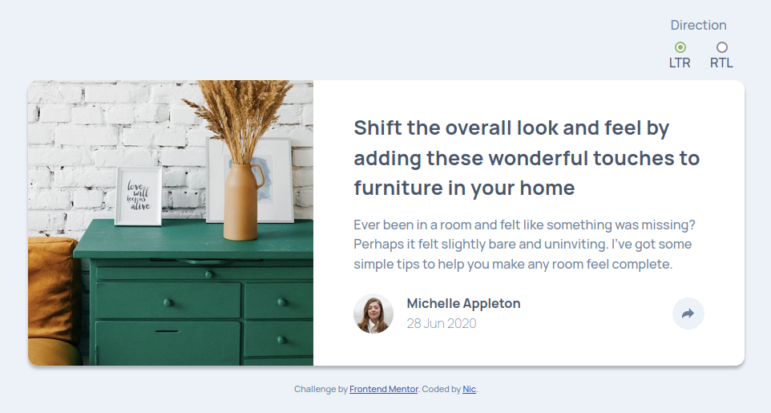

# Frontend Mentor - Article preview component solution

This is a solution to the [Article preview component challenge on Frontend Mentor](https://www.frontendmentor.io/challenges/article-preview-component-dYBN_pYFT). Frontend Mentor challenges help you improve your coding skills by building realistic projects.

## Table of contents

- [Overview](#overview)
  - [The challenge](#the-challenge)
  - [Screenshot](#screenshot)
  - [Links](#links)
- [My process](#my-process)
  - [Built with](#built-with)
  - [What I learned](#what-i-learned)
  - [Useful resources](#useful-resources)
- [Author](#author)

## Overview

### The challenge

Users should be able to:

- View the optimal layout for the component depending on their device's screen size
- See the social media share links when they click the share icon

### Screenshot

### Links

- [Live Site URL](https://article-preview-nicm42.vercel.app/)

## My process

### Built with

- HTML
- SCSS
- CSS logical properties
- TypeScript
- Rollup
- Cypress

### What I learned

CSS Logical properties. I've used them a bit before, but I wanted to show myself how useful they are if you're creating something that needs to work with both LTR and RTL text. I added radio buttons to this, in order to test that the same CSS file works the same in both directions. Currently Safari on iOS doesn't support the border radius logical properties.

Rollup. Having used Gulp, Parcel and Webpack before, I wanted to try another bundler. It took me a little while to get my head around what was going on. And I think I ended up with something more complicated than I needed, because I added a plugin for live reload, but it also did that when I built it too.

### Useful resources

[CSS Tricks: CSS Logical Properties](https://css-tricks.com/css-logical-properties/)

## Author

- Website - [Nic](https://www.nicm42.co.uk)
- Frontend Mentor - [@nicm42](https://www.frontendmentor.io/profile/nicm42)
- Twitter - [@nicm4242](https://www.twitter.com/nicm4242)
